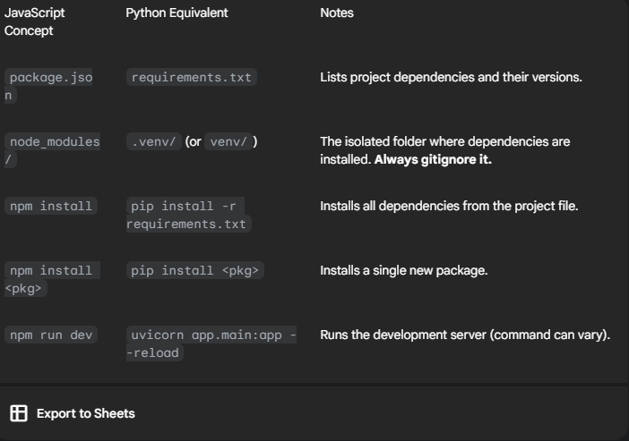

# How to start a python project

## Step 1: Create a virtual environment

```
> python -m venv .venv
```

This tells Python to run its built-in venv module and create a new environment in a folder named .venv.

## Step 2: Activate it:

```
.\.venv\Scripts\activate
```

This is the most important step that's slightly different from Node.js. You have to "activate" the environment to tell your terminal session to use the Python and packages inside .venv instead of the ones on your system.

From now on, for this project, always make sure your virtual environment is active before you install packages or run your code.

## Step 3: Install Your Dependencies

Now that your virtual environment is active, you can use pip (Python's package installer, like npm or yarn for nodejs) to install the packages we discussed.

We'll install FastAPI (the web framework), Uvicorn (the server that runs it), and your LangChain packages.

```
pip install "fastapi[all]" uvicorn langchain langchain-openai langgraph python-dotenv
```

## Step 4: Create Your requirements.txt File

Now that the packages are installed, you need to create your requirements.txt file to lock down the versions. This is the equivalent of your package.json's dependency list.

Run the pip freeze command, which lists all installed packages and their exact versions, and save it to a file.

```
pip freeze > requirements.txt
```

You must repeat this step after every time you install some new packages. Do not forget!
Your requirements.txt file will now contain something like this:

```
fastapi==0.111.0
langchain==0.2.1
langgraph==0.0.63
... (and all their sub-dependencies)
```

Now, if you move this project to another computer (or a deployment server), you can just create and activate a new virtual environment and run ` pip install -r requirements.txt` to get the exact same setup.

## Step 5: Configure Your .gitignore

Create a .gitignore file in your chatbot_project root directory (the parent of backend and frontend).

chatbot_project/.gitignore:

```
# Python backend

/backend/.venv/
/backend/**pycache**/
/backend/.env

# Frontend (example for Create React App)

/frontend/node_modules/
/frontend/build/
/frontend/.env

# OS-specific

.DS_Store
```


